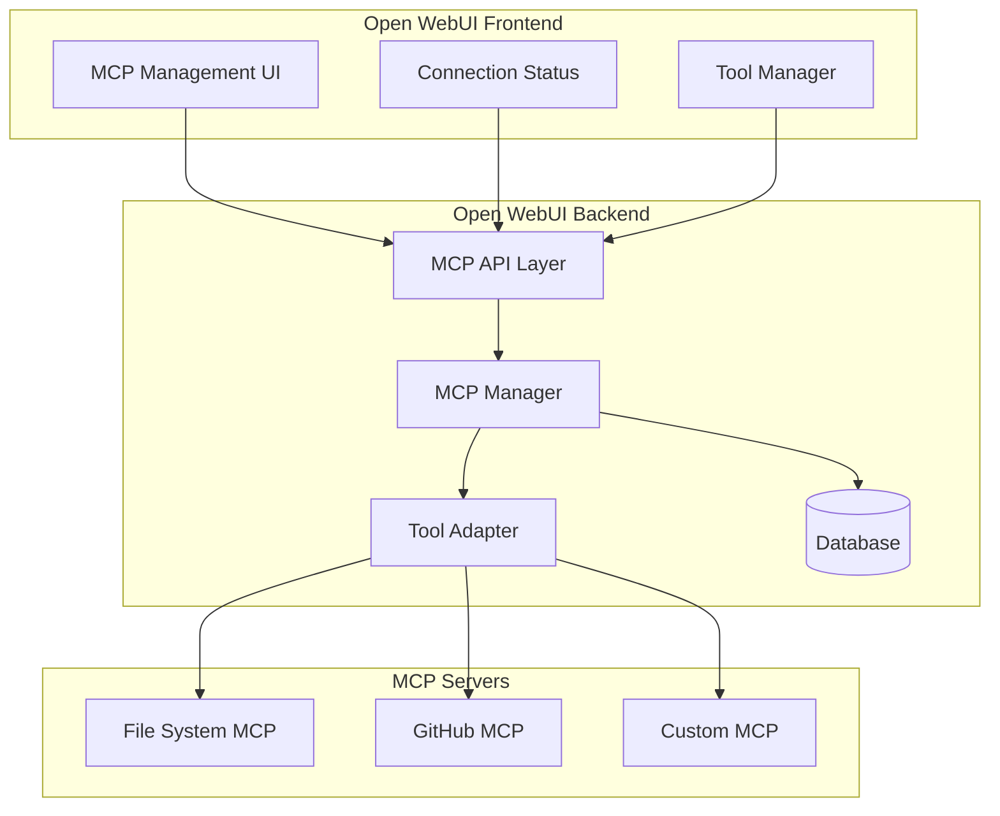

# MCP (Model Context Protocol) Integration Design for Open WebUI

## Executive Summary

This document outlines the design for integrating MCP (Model Context Protocol) support into Open WebUI, enabling users to connect and use MCP servers as tools within their AI conversations.

## Architecture Overview



## Component Design

### 1. Database Schema

```sql
-- MCP Servers table
CREATE TABLE mcp_servers (
    id VARCHAR PRIMARY KEY,
    user_id VARCHAR NOT NULL,
    name TEXT NOT NULL,
    transport_type VARCHAR NOT NULL, -- 'stdio', 'http', 'websocket'
    command TEXT, -- for stdio transport
    url TEXT, -- for http/websocket transport
    args JSONB, -- command arguments
    env JSONB, -- environment variables
    enabled BOOLEAN DEFAULT true,
    meta JSONB,
    created_at BIGINT,
    updated_at BIGINT,
    FOREIGN KEY (user_id) REFERENCES users(id)
);

-- MCP Tools mapping table
CREATE TABLE mcp_tools (
    id VARCHAR PRIMARY KEY,
    server_id VARCHAR NOT NULL,
    tool_name VARCHAR NOT NULL,
    description TEXT,
    parameters JSONB,
    enabled BOOLEAN DEFAULT true,
    created_at BIGINT,
    FOREIGN KEY (server_id) REFERENCES mcp_servers(id) ON DELETE CASCADE
);
```

### 2. Backend API Design

#### 2.1 MCP Models (`/backend/open_webui/models/mcp.py`)

```python
from pydantic import BaseModel
from typing import Optional, Dict, List, Literal
from sqlalchemy import Column, String, Text, JSON, Boolean, BigInteger
from open_webui.internal.db import Base, JSONField

class MCPTransportType(str, Enum):
    STDIO = "stdio"
    HTTP = "http"
    WEBSOCKET = "websocket"

class MCPServer(Base):
    __tablename__ = "mcp_servers"
    
    id = Column(String, primary_key=True)
    user_id = Column(String, nullable=False)
    name = Column(Text, nullable=False)
    transport_type = Column(String, nullable=False)
    command = Column(Text)
    url = Column(Text)
    args = Column(JSONField)
    env = Column(JSONField)
    enabled = Column(Boolean, default=True)
    meta = Column(JSONField)
    created_at = Column(BigInteger)
    updated_at = Column(BigInteger)

class MCPServerModel(BaseModel):
    id: str
    user_id: str
    name: str
    transport_type: MCPTransportType
    command: Optional[str] = None
    url: Optional[str] = None
    args: Optional[List[str]] = []
    env: Optional[Dict[str, str]] = {}
    enabled: bool = True
    meta: Optional[Dict] = {}
    created_at: int
    updated_at: int

class MCPServerForm(BaseModel):
    name: str
    transport_type: MCPTransportType
    command: Optional[str] = None
    url: Optional[str] = None
    args: Optional[List[str]] = []
    env: Optional[Dict[str, str]] = {}
    enabled: bool = True
```

#### 2.2 MCP Router (`/backend/open_webui/routers/mcp.py`)

```python
from fastapi import APIRouter, Depends, HTTPException, status
from typing import List, Optional
from open_webui.models.mcp import MCPServers, MCPServerForm, MCPServerModel
from open_webui.utils.auth import get_verified_user

router = APIRouter()

@router.get("/", response_model=List[MCPServerModel])
async def get_mcp_servers(user=Depends(get_verified_user)):
    """Get all MCP servers for the current user"""
    return MCPServers.get_servers_by_user_id(user.id)

@router.post("/", response_model=MCPServerModel)
async def create_mcp_server(
    form_data: MCPServerForm,
    user=Depends(get_verified_user)
):
    """Create a new MCP server configuration"""
    server = MCPServers.create_server(user.id, form_data)
    if server:
        return server
    raise HTTPException(status_code=400, detail="Failed to create MCP server")

@router.get("/{server_id}", response_model=MCPServerModel)
async def get_mcp_server(
    server_id: str,
    user=Depends(get_verified_user)
):
    """Get a specific MCP server configuration"""
    server = MCPServers.get_server_by_id_and_user(server_id, user.id)
    if server:
        return server
    raise HTTPException(status_code=404, detail="MCP server not found")

@router.put("/{server_id}", response_model=MCPServerModel)
async def update_mcp_server(
    server_id: str,
    form_data: MCPServerForm,
    user=Depends(get_verified_user)
):
    """Update an MCP server configuration"""
    server = MCPServers.update_server(server_id, user.id, form_data)
    if server:
        return server
    raise HTTPException(status_code=404, detail="MCP server not found")

@router.delete("/{server_id}")
async def delete_mcp_server(
    server_id: str,
    user=Depends(get_verified_user)
):
    """Delete an MCP server configuration"""
    if MCPServers.delete_server(server_id, user.id):
        return {"detail": "MCP server deleted successfully"}
    raise HTTPException(status_code=404, detail="MCP server not found")

@router.post("/{server_id}/test")
async def test_mcp_connection(
    server_id: str,
    user=Depends(get_verified_user)
):
    """Test connection to an MCP server"""
    from open_webui.utils.mcp import test_mcp_connection
    
    server = MCPServers.get_server_by_id_and_user(server_id, user.id)
    if not server:
        raise HTTPException(status_code=404, detail="MCP server not found")
    
    result = await test_mcp_connection(server)
    return {"status": result.status, "message": result.message, "tools": result.tools}

@router.get("/{server_id}/tools")
async def get_mcp_tools(
    server_id: str,
    user=Depends(get_verified_user)
):
    """Get available tools from an MCP server"""
    from open_webui.utils.mcp import get_mcp_tools
    
    server = MCPServers.get_server_by_id_and_user(server_id, user.id)
    if not server:
        raise HTTPException(status_code=404, detail="MCP server not found")
    
    tools = await get_mcp_tools(server)
    return {"tools": tools}
```

#### 2.3 MCP Manager (`/backend/open_webui/utils/mcp.py`)

```python
import asyncio
import json
import subprocess
from typing import Dict, List, Optional, Any
from dataclasses import dataclass
import httpx
import websockets
from open_webui.models.mcp import MCPServerModel, MCPTransportType

@dataclass
class MCPConnection:
    server: MCPServerModel
    process: Optional[subprocess.Popen] = None
    client: Optional[Any] = None
    
class MCPManager:
    def __init__(self):
        self.connections: Dict[str, MCPConnection] = {}
        
    async def connect(self, server: MCPServerModel) -> MCPConnection:
        """Establish connection to an MCP server"""
        if server.id in self.connections:
            return self.connections[server.id]
            
        connection = MCPConnection(server=server)
        
        if server.transport_type == MCPTransportType.STDIO:
            connection = await self._connect_stdio(connection)
        elif server.transport_type == MCPTransportType.HTTP:
            connection = await self._connect_http(connection)
        elif server.transport_type == MCPTransportType.WEBSOCKET:
            connection = await self._connect_websocket(connection)
            
        self.connections[server.id] = connection
        return connection
        
    async def _connect_stdio(self, connection: MCPConnection) -> MCPConnection:
        """Connect to MCP server via stdio transport"""
        server = connection.server
        
        # Prepare environment
        env = os.environ.copy()
        if server.env:
            env.update(server.env)
            
        # Start process
        cmd = [server.command] + (server.args or [])
        connection.process = subprocess.Popen(
            cmd,
            stdin=subprocess.PIPE,
            stdout=subprocess.PIPE,
            stderr=subprocess.PIPE,
            env=env,
            text=True
        )
        
        # Initialize JSON-RPC communication
        await self._initialize_jsonrpc(connection)
        return connection
        
    async def _connect_http(self, connection: MCPConnection) -> MCPConnection:
        """Connect to MCP server via HTTP transport"""
        connection.client = httpx.AsyncClient(base_url=connection.server.url)
        return connection
        
    async def _connect_websocket(self, connection: MCPConnection) -> MCPConnection:
        """Connect to MCP server via WebSocket transport"""
        connection.client = await websockets.connect(connection.server.url)
        return connection
        
    async def call_tool(self, server_id: str, tool_name: str, arguments: Dict) -> Any:
        """Call a tool on an MCP server"""
        connection = self.connections.get(server_id)
        if not connection:
            raise ValueError(f"No connection to server {server_id}")
            
        # Implement JSON-RPC call based on transport type
        if connection.server.transport_type == MCPTransportType.STDIO:
            return await self._call_tool_stdio(connection, tool_name, arguments)
        elif connection.server.transport_type == MCPTransportType.HTTP:
            return await self._call_tool_http(connection, tool_name, arguments)
        elif connection.server.transport_type == MCPTransportType.WEBSOCKET:
            return await self._call_tool_websocket(connection, tool_name, arguments)
            
    async def disconnect(self, server_id: str):
        """Disconnect from an MCP server"""
        if server_id in self.connections:
            connection = self.connections[server_id]
            
            if connection.process:
                connection.process.terminate()
                await asyncio.sleep(0.5)
                if connection.process.poll() is None:
                    connection.process.kill()
                    
            if connection.client:
                if hasattr(connection.client, 'close'):
                    await connection.client.close()
                    
            del self.connections[server_id]

# Global MCP manager instance
mcp_manager = MCPManager()

async def test_mcp_connection(server: MCPServerModel) -> Dict:
    """Test connection to an MCP server"""
    try:
        connection = await mcp_manager.connect(server)
        # Send initialization request
        tools = await mcp_manager.get_available_tools(server.id)
        return {
            "status": "success",
            "message": "Connection successful",
            "tools": tools
        }
    except Exception as e:
        return {
            "status": "error",
            "message": str(e),
            "tools": []
        }
```

### 3. Frontend Components

#### 3.1 MCP Settings Component (`/src/lib/components/admin/Settings/MCP.svelte`)

```svelte
<script lang="ts">
    import { onMount, getContext } from 'svelte';
    import { toast } from 'svelte-sonner';
    import { getMCPServers, createMCPServer, updateMCPServer, deleteMCPServer, testMCPConnection } from '$lib/apis/mcp';
    
    import Plus from '$lib/components/icons/Plus.svelte';
    import Spinner from '$lib/components/common/Spinner.svelte';
    import MCPServerCard from './MCP/MCPServerCard.svelte';
    import MCPServerModal from './MCP/MCPServerModal.svelte';
    
    const i18n = getContext('i18n');
    
    let servers = [];
    let loading = true;
    let showAddModal = false;
    let selectedServer = null;
    
    const loadServers = async () => {
        loading = true;
        try {
            servers = await getMCPServers(localStorage.token);
        } catch (error) {
            toast.error($i18n.t('Failed to load MCP servers'));
        } finally {
            loading = false;
        }
    };
    
    const handleCreateServer = async (serverData) => {
        try {
            const newServer = await createMCPServer(localStorage.token, serverData);
            servers = [...servers, newServer];
            toast.success($i18n.t('MCP server created successfully'));
            showAddModal = false;
        } catch (error) {
            toast.error($i18n.t('Failed to create MCP server'));
        }
    };
    
    const handleUpdateServer = async (serverId, serverData) => {
        try {
            const updatedServer = await updateMCPServer(localStorage.token, serverId, serverData);
            servers = servers.map(s => s.id === serverId ? updatedServer : s);
            toast.success($i18n.t('MCP server updated successfully'));
        } catch (error) {
            toast.error($i18n.t('Failed to update MCP server'));
        }
    };
    
    const handleDeleteServer = async (serverId) => {
        try {
            await deleteMCPServer(localStorage.token, serverId);
            servers = servers.filter(s => s.id !== serverId);
            toast.success($i18n.t('MCP server deleted successfully'));
        } catch (error) {
            toast.error($i18n.t('Failed to delete MCP server'));
        }
    };
    
    const handleTestConnection = async (serverId) => {
        try {
            const result = await testMCPConnection(localStorage.token, serverId);
            if (result.status === 'success') {
                toast.success($i18n.t('Connection successful'));
            } else {
                toast.error($i18n.t('Connection failed: {{message}}', { message: result.message }));
            }
        } catch (error) {
            toast.error($i18n.t('Failed to test connection'));
        }
    };
    
    onMount(() => {
        loadServers();
    });
</script>

<div class="flex flex-col h-full">
    <div class="flex justify-between items-center mb-4">
        <div class="flex items-center gap-2">
            <h3 class="text-lg font-semibold">{$i18n.t('MCP Servers')}</h3>
            <div class="text-sm text-gray-500">
                {$i18n.t('Connect to MCP servers to extend functionality')}
            </div>
        </div>
        
        <button
            class="px-3 py-2 rounded-lg bg-primary-600 text-white hover:bg-primary-700 flex items-center gap-2"
            on:click={() => showAddModal = true}
        >
            <Plus className="w-4 h-4" />
            {$i18n.t('Add Server')}
        </button>
    </div>
    
    {#if loading}
        <div class="flex justify-center items-center h-64">
            <Spinner />
        </div>
    {:else if servers.length === 0}
        <div class="flex flex-col items-center justify-center h-64 text-gray-500">
            <div class="text-4xl mb-4">🔌</div>
            <div class="text-lg mb-2">{$i18n.t('No MCP servers configured')}</div>
            <div class="text-sm">{$i18n.t('Add your first MCP server to get started')}</div>
        </div>
    {:else}
        <div class="space-y-3">
            {#each servers as server}
                <MCPServerCard
                    {server}
                    on:edit={() => selectedServer = server}
                    on:delete={() => handleDeleteServer(server.id)}
                    on:test={() => handleTestConnection(server.id)}
                    on:toggle={(e) => handleUpdateServer(server.id, { ...server, enabled: e.detail })}
                />
            {/each}
        </div>
    {/if}
</div>

{#if showAddModal}
    <MCPServerModal
        on:save={handleCreateServer}
        on:close={() => showAddModal = false}
    />
{/if}

{#if selectedServer}
    <MCPServerModal
        server={selectedServer}
        on:save={(e) => handleUpdateServer(selectedServer.id, e.detail)}
        on:close={() => selectedServer = null}
    />
{/if}
```

#### 3.2 MCP Server Modal (`/src/lib/components/admin/Settings/MCP/MCPServerModal.svelte`)

```svelte
<script lang="ts">
    import { createEventDispatcher, getContext } from 'svelte';
    import Modal from '$lib/components/common/Modal.svelte';
    
    export let server = null;
    
    const dispatch = createEventDispatcher();
    const i18n = getContext('i18n');
    
    let formData = {
        name: server?.name || '',
        transport_type: server?.transport_type || 'stdio',
        command: server?.command || '',
        url: server?.url || '',
        args: server?.args || [],
        env: server?.env || {},
        enabled: server?.enabled ?? true
    };
    
    let newArg = '';
    let newEnvKey = '';
    let newEnvValue = '';
    
    const transportTypes = [
        { value: 'stdio', label: 'Standard I/O' },
        { value: 'http', label: 'HTTP' },
        { value: 'websocket', label: 'WebSocket' }
    ];
    
    const handleSubmit = () => {
        if (!formData.name) {
            return;
        }
        
        if (formData.transport_type === 'stdio' && !formData.command) {
            return;
        }
        
        if ((formData.transport_type === 'http' || formData.transport_type === 'websocket') && !formData.url) {
            return;
        }
        
        dispatch('save', formData);
    };
    
    const addArgument = () => {
        if (newArg.trim()) {
            formData.args = [...formData.args, newArg.trim()];
            newArg = '';
        }
    };
    
    const removeArgument = (index) => {
        formData.args = formData.args.filter((_, i) => i !== index);
    };
    
    const addEnvironmentVariable = () => {
        if (newEnvKey.trim() && newEnvValue.trim()) {
            formData.env = { ...formData.env, [newEnvKey.trim()]: newEnvValue.trim() };
            newEnvKey = '';
            newEnvValue = '';
        }
    };
    
    const removeEnvironmentVariable = (key) => {
        const { [key]: _, ...rest } = formData.env;
        formData.env = rest;
    };
</script>

<Modal on:close>
    <div class="px-6 py-4">
        <h3 class="text-lg font-semibold mb-4">
            {server ? $i18n.t('Edit MCP Server') : $i18n.t('Add MCP Server')}
        </h3>
        
        <div class="space-y-4">
            <!-- Name -->
            <div>
                <label class="block text-sm font-medium mb-1">{$i18n.t('Name')}</label>
                <input
                    type="text"
                    bind:value={formData.name}
                    class="w-full px-3 py-2 border rounded-lg"
                    placeholder={$i18n.t('My MCP Server')}
                />
            </div>
            
            <!-- Transport Type -->
            <div>
                <label class="block text-sm font-medium mb-1">{$i18n.t('Transport Type')}</label>
                <select
                    bind:value={formData.transport_type}
                    class="w-full px-3 py-2 border rounded-lg"
                >
                    {#each transportTypes as type}
                        <option value={type.value}>{type.label}</option>
                    {/each}
                </select>
            </div>
            
            <!-- Command (for stdio) -->
            {#if formData.transport_type === 'stdio'}
                <div>
                    <label class="block text-sm font-medium mb-1">{$i18n.t('Command')}</label>
                    <input
                        type="text"
                        bind:value={formData.command}
                        class="w-full px-3 py-2 border rounded-lg"
                        placeholder="npx @modelcontextprotocol/server-filesystem"
                    />
                </div>
                
                <!-- Arguments -->
                <div>
                    <label class="block text-sm font-medium mb-1">{$i18n.t('Arguments')}</label>
                    <div class="space-y-2">
                        {#each formData.args as arg, index}
                            <div class="flex items-center gap-2">
                                <input
                                    type="text"
                                    value={arg}
                                    class="flex-1 px-3 py-2 border rounded-lg"
                                    readonly
                                />
                                <button
                                    on:click={() => removeArgument(index)}
                                    class="text-red-500 hover:text-red-700"
                                >
                                    ✕
                                </button>
                            </div>
                        {/each}
                        
                        <div class="flex items-center gap-2">
                            <input
                                type="text"
                                bind:value={newArg}
                                on:keypress={(e) => e.key === 'Enter' && addArgument()}
                                class="flex-1 px-3 py-2 border rounded-lg"
                                placeholder={$i18n.t('Add argument')}
                            />
                            <button
                                on:click={addArgument}
                                class="px-3 py-2 bg-gray-200 rounded-lg hover:bg-gray-300"
                            >
                                +
                            </button>
                        </div>
                    </div>
                </div>
            {/if}
            
            <!-- URL (for http/websocket) -->
            {#if formData.transport_type === 'http' || formData.transport_type === 'websocket'}
                <div>
                    <label class="block text-sm font-medium mb-1">{$i18n.t('URL')}</label>
                    <input
                        type="text"
                        bind:value={formData.url}
                        class="w-full px-3 py-2 border rounded-lg"
                        placeholder={formData.transport_type === 'http' ? 'https://example.com/mcp' : 'ws://example.com/mcp'}
                    />
                </div>
            {/if}
            
            <!-- Environment Variables -->
            <div>
                <label class="block text-sm font-medium mb-1">{$i18n.t('Environment Variables')}</label>
                <div class="space-y-2">
                    {#each Object.entries(formData.env) as [key, value]}
                        <div class="flex items-center gap-2">
                            <input
                                type="text"
                                value={key}
                                class="flex-1 px-3 py-2 border rounded-lg"
                                readonly
                            />
                            <input
                                type="text"
                                value={value}
                                class="flex-1 px-3 py-2 border rounded-lg"
                                readonly
                            />
                            <button
                                on:click={() => removeEnvironmentVariable(key)}
                                class="text-red-500 hover:text-red-700"
                            >
                                ✕
                            </button>
                        </div>
                    {/each}
                    
                    <div class="flex items-center gap-2">
                        <input
                            type="text"
                            bind:value={newEnvKey}
                            class="flex-1 px-3 py-2 border rounded-lg"
                            placeholder={$i18n.t('Key')}
                        />
                        <input
                            type="text"
                            bind:value={newEnvValue}
                            class="flex-1 px-3 py-2 border rounded-lg"
                            placeholder={$i18n.t('Value')}
                        />
                        <button
                            on:click={addEnvironmentVariable}
                            class="px-3 py-2 bg-gray-200 rounded-lg hover:bg-gray-300"
                        >
                            +
                        </button>
                    </div>
                </div>
            </div>
            
            <!-- Enabled -->
            <div class="flex items-center gap-2">
                <input
                    type="checkbox"
                    bind:checked={formData.enabled}
                    id="enabled"
                />
                <label for="enabled" class="text-sm">
                    {$i18n.t('Enable this server')}
                </label>
            </div>
        </div>
        
        <div class="flex justify-end gap-2 mt-6">
            <button
                on:click={() => dispatch('close')}
                class="px-4 py-2 border rounded-lg hover:bg-gray-50"
            >
                {$i18n.t('Cancel')}
            </button>
            <button
                on:click={handleSubmit}
                class="px-4 py-2 bg-primary-600 text-white rounded-lg hover:bg-primary-700"
            >
                {$i18n.t('Save')}
            </button>
        </div>
    </div>
</Modal>
```

### 4. Tool Adapter Design

The Tool Adapter will bridge MCP tools to Open WebUI's existing tool system:

#### 4.1 MCP Tool Adapter (`/backend/open_webui/utils/mcp_tool_adapter.py`)

```python
from typing import Dict, List, Any
from open_webui.models.tools import Tools, ToolForm
from open_webui.models.mcp import MCPServers
from open_webui.utils.mcp import mcp_manager
import json

class MCPToolAdapter:
    """Adapts MCP tools to Open WebUI's tool system"""
    
    @staticmethod
    async def sync_mcp_tools(user_id: str):
        """Sync all MCP tools for a user"""
        servers = MCPServers.get_servers_by_user_id(user_id)
        
        for server in servers:
            if not server.enabled:
                continue
                
            try:
                # Connect to MCP server
                await mcp_manager.connect(server)
                
                # Get available tools
                tools = await mcp_manager.get_available_tools(server.id)
                
                # Create/update Open WebUI tools
                for mcp_tool in tools:
                    tool_id = f"mcp_{server.id}_{mcp_tool['name']}"
                    
                    # Generate tool content
                    content = MCPToolAdapter._generate_tool_content(
                        server.id,
                        mcp_tool
                    )
                    
                    # Create tool spec
                    spec = {
                        "name": mcp_tool['name'],
                        "description": mcp_tool.get('description', ''),
                        "parameters": mcp_tool.get('inputSchema', {})
                    }
                    
                    # Check if tool exists
                    existing_tool = Tools.get_tool_by_id(tool_id)
                    
                    if existing_tool:
                        # Update existing tool
                        Tools.update_tool_by_id(
                            tool_id,
                            ToolForm(
                                id=tool_id,
                                name=f"MCP: {server.name} - {mcp_tool['name']}",
                                content=content,
                                specs=[spec],
                                meta={
                                    "type": "mcp",
                                    "server_id": server.id,
                                    "mcp_tool_name": mcp_tool['name']
                                }
                            )
                        )
                    else:
                        # Create new tool
                        Tools.create_tool(
                            user_id,
                            ToolForm(
                                id=tool_id,
                                name=f"MCP: {server.name} - {mcp_tool['name']}",
                                content=content,
                                specs=[spec],
                                meta={
                                    "type": "mcp",
                                    "server_id": server.id,
                                    "mcp_tool_name": mcp_tool['name']
                                }
                            )
                        )
                        
            except Exception as e:
                print(f"Failed to sync tools from server {server.id}: {str(e)}")
                
    @staticmethod
    def _generate_tool_content(server_id: str, mcp_tool: Dict) -> str:
        """Generate Python code for MCP tool wrapper"""
        
        return f'''
import json
from typing import Dict, Any

class Tools:
    def __init__(self):
        self.citation = True
        
    async def {mcp_tool['name']}(self, **kwargs) -> Dict[str, Any]:
        """
        {mcp_tool.get('description', 'MCP Tool')}
        
        This is an MCP tool wrapper that calls the actual MCP server.
        """
        from open_webui.utils.mcp import mcp_manager
        
        try:
            # Call the MCP tool
            result = await mcp_manager.call_tool(
                "{server_id}",
                "{mcp_tool['name']}",
                kwargs
            )
            
            return {{
                "status": "success",
                "result": result
            }}
            
        except Exception as e:
            return {{
                "status": "error",
                "error": str(e)
            }}
'''

    @staticmethod
    async def remove_mcp_tools(server_id: str, user_id: str):
        """Remove all tools associated with an MCP server"""
        # Get all tools for this user
        tools = Tools.get_tools_by_user_id(user_id)
        
        # Filter and delete MCP tools for this server
        for tool in tools:
            if (tool.meta and 
                tool.meta.get('type') == 'mcp' and 
                tool.meta.get('server_id') == server_id):
                Tools.delete_tool_by_id(tool.id)
```

### 5. Integration Points

1. **Main App Integration** (`/backend/open_webui/main.py`):
   - Add MCP router to the FastAPI app
   - Initialize MCP manager on startup
   - Clean up MCP connections on shutdown

2. **Tool System Integration**:
   - MCP tools appear as regular tools in the tool selector
   - Automatic sync when MCP servers are added/updated
   - Tool execution routes through MCP manager

3. **UI Integration**:
   - Add MCP settings to admin panel
   - Show MCP connection status in UI
   - Allow enabling/disabling MCP tools per chat

## Security Considerations

1. **Process Isolation**: 
   - Run MCP servers in isolated processes
   - Limit resource usage per server
   - Implement timeout mechanisms

2. **Access Control**:
   - MCP servers are user-specific
   - Tools inherit Open WebUI's access control
   - Validate all inputs/outputs

3. **Network Security**:
   - Validate URLs for HTTP/WebSocket transports
   - Use HTTPS/WSS where possible
   - Implement request signing for HTTP

## Performance Considerations

1. **Connection Pooling**:
   - Maintain persistent connections
   - Implement connection health checks
   - Auto-reconnect on failure

2. **Caching**:
   - Cache tool definitions
   - Cache frequently used results
   - Implement TTL for cache entries

3. **Resource Management**:
   - Limit concurrent MCP connections
   - Implement request queuing
   - Monitor resource usage

## Migration Path

1. **Phase 1**: Core MCP support
   - Basic stdio transport
   - Manual tool sync
   - Simple UI

2. **Phase 2**: Enhanced features
   - HTTP/WebSocket transport
   - Automatic tool sync
   - Advanced UI features

3. **Phase 3**: Enterprise features
   - Multi-user MCP servers
   - Advanced security
   - Performance optimizations

## Testing Strategy

1. **Unit Tests**:
   - MCP manager functions
   - Tool adapter logic
   - API endpoints

2. **Integration Tests**:
   - End-to-end MCP server connection
   - Tool execution
   - Error handling

3. **Example MCP Servers**:
   - File system access
   - Web search
   - Custom demo server